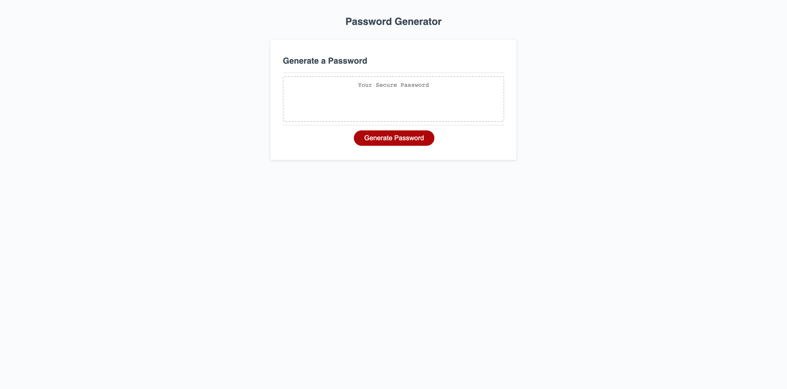
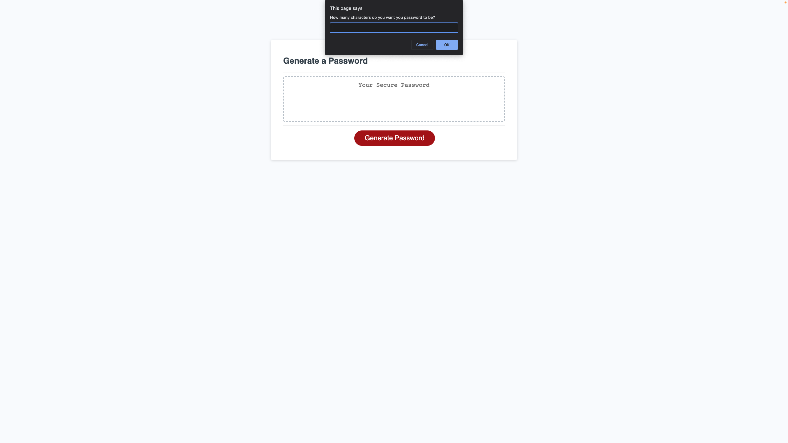
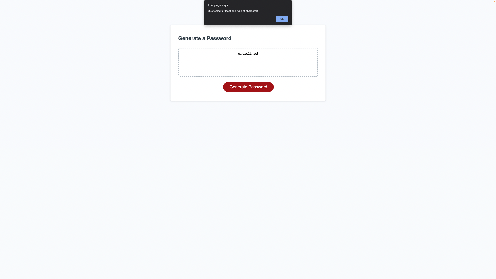
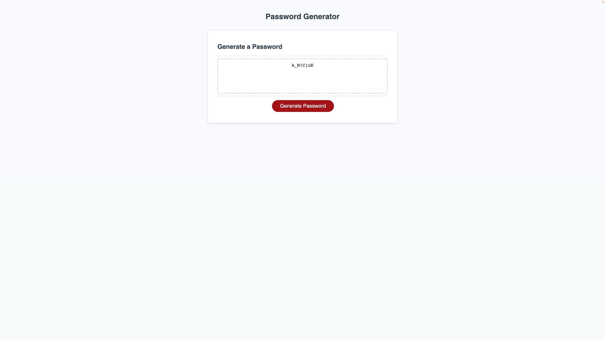

# Challenge-3---Password-Generator

## Description

This build is a randomized password generator built using mostly JavaScript.

### Here are some screenshots of the website:

>This was the starter website I was provided with

>This picture is demonstrating the alert window asking for password length

>This picture is demonstrating the error alert that comes up when you don't enter a number within the specified range

>This picture is demonstrating the error alert that occurs when the user does not specify at least ONE character type

>This picture is demonstrating a succesful password randomization attempt

This project was intended to test my ability to develop the logic behind a dynamic website. 

I d
